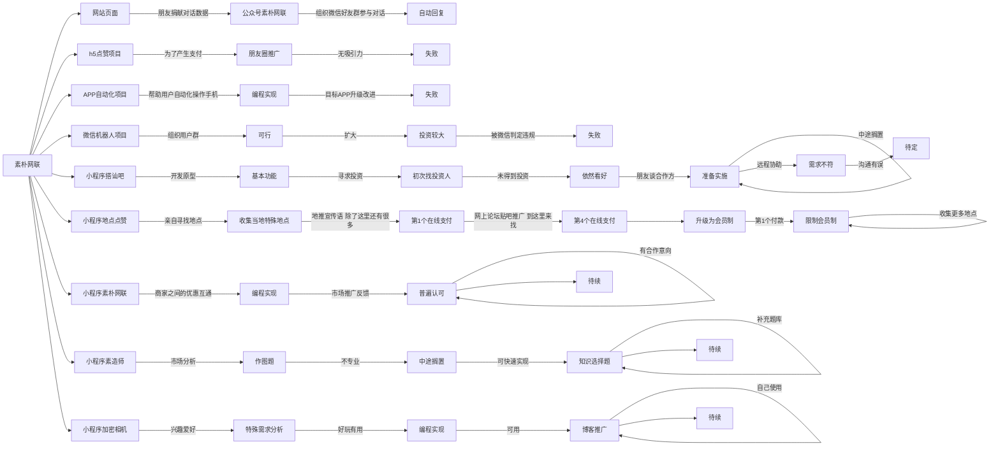

# -
素朴网联5年计划

`人工智能技术的发展仍是未来的方向，随着技术不断发展，数据也将变得重要。语言是人类知识的表达方式，我希望素朴网联能积累人类知识--积累并整理语言--语料库。虽然现有的大公司，他们应该都早已积累了大量的语料库，比如腾讯，阿里，京东，以及更多互联网公司。但是这并不妨碍我们积累属于自己的语料库，语料库仅作为人类知识的存储方式，未来用于机器人学习人类文化，或者人类通过基于语料库所做的产品得到所需的服务，比如找到和自己思想吻合度99%的另外一个人，比如和过去的自己面对面交流，还有很多想法等着实现，而这一切，都基于真实有效的正确的语料库。`

`我创办公司，怀着一个远大的目标，随身携带了一点粮草就出发了，当我走出去1%的时候，发现盈利是暂时无法做到的。于是我开始思考如何走得更远，从而达到目标。接下来，我将介绍从1%走到5%的这段路，我创造了哪些项目，这些项目的目标很简单，赚钱，从而支持我实现语料库的目标。`

