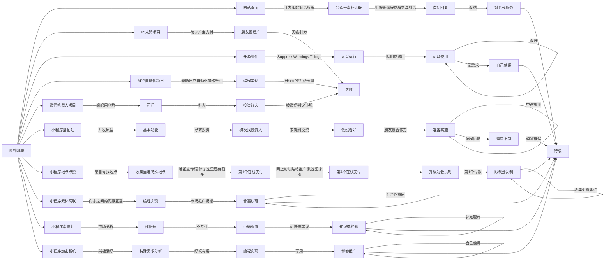

# -
素朴网联5年计划

### 前言

`人工智能技术的发展仍是未来的方向，随着技术不断发展，数据也将变得重要。语言是人类知识的表达方式，我希望素朴网联能积累人类知识--积累并整理语言--语料库。虽然现有的大公司，他们应该都早已积累了大量的语料库，比如腾讯，阿里，京东，以及更多互联网公司。但是这并不妨碍我们积累属于自己的语料库，语料库仅作为人类知识的存储方式，未来用于机器人学习人类文化，或者人类通过基于语料库所做的产品得到所需的服务，比如找到和自己思想吻合度99%的另外一个人，比如和过去的自己面对面交流，还有很多想法等着实现，而这一切，都基于真实有效的正确的语料库。`

`我创办公司，怀着一个远大的目标，随身携带了一点粮草就出发了，当我走出去1%的时候，发现盈利是暂时无法做到的。于是我开始思考如何走得更远，从而达到目标。接下来，我将介绍从1%走到5%的这段路，我创造了哪些项目，这些项目的目标很简单，赚钱，从而支持我实现语料库的目标。`

### 分解

> h5点赞项目

1. 思路：    

   朋友圈集赞仅限于朋友之间，数量有限。如果想得到1w+的点赞，就需要拓展到朋友圈之外。通过h5页面在朋友圈之间分享传播，通过集赞满1000得到现金奖励的方式推动分享和点赞。其中，评论留言的功能设计，是为了获得语料数据。

2. 开发经历：       

   我设计了交互流程 --> 开发OSGi模块(com.suppresswarnings.like) --> 新认识的朋友愿意参与开发前端h5 --> 完成了点赞和留言功能 --> 增加投资付款功能 --> 完成，朋友圈内推广。

3. 推广实施经历：      

   在朋友圈内邀请好友进去点赞分享 --> 总共不到100人参与 --> 不看好一分钱的点赞和评论奖励 --> 参与度不高，搁置。

4. 总结：    

   吸引力不高，用户不愿意参与，更不愿意评论。朋友圈之外的第二层，已经失去了传播能力。

> 开源组件SuppressWarnings.Things

1. 思路：    

   通过素朴网联公众号，我可以和我的服务器进行交流，如果把这个功能单独抽出来，写成一个中间件，开源发布到maven中央库，让更多开发者使用，从而获得更多微信公众号粉丝，开源也可以得到更多开发者的支持。

2. 开发经历：       

   创建maven项目[^com.suppresswarnings.things]--> 申请[^Sonatype]账户并创建项目 --> 修改pom.xml --> 发布成功 --> 通过dependency试用可行 --> 邀请同事朋友使用并提出建议 --> 自己写demo

   [^Sonatype]: https://oss.sonatype.org/
   [^com.suppresswarnings.things]: https://github.com/outermanjiaming/suppresswarnings/tree/master/com.suppresswarnings.things

3. 推广实施经历：      

   写出来之后很兴奋，因为我的jar包可以通过pom直接下载使用。邀请好朋友使用，他们都抽空使用了，也有2个朋友提出了建议，还发布了issue，完善了wiki，但朋友们都没有这一类需求，更考虑到组建通过我的公众号可以直接操作服务器，有安全隐患的考虑。除了我自己写了的几个实际运用的工具，没有其他人真正使用它。

4. 总结：    

   将代码发布到maven中央库是一次正确的尝试，本次的组件设计，我考虑了通信安全（双向安全认证https证书，客户端证书混淆加密存储在代码中），但是对于安全级别比较高的应用场景，可能还是不适合外人使用。但是对于我自己开发新的工具，是可以提高开发效率。未来依然可以挖掘[^SuppressWarnings.Things]组件的能力。

   [^SuppressWarnings.Things]: https://mvnrepository.com/artifact/com.suppresswarnings/com.suppresswarnings.things

> APP自动化项目

1. 思路：    

   安卓手机可以通过程序自动化控制手机，比如自动阅读，自动看视频，自动点击按钮，。。。如果我们提供这种自动化操作的APP给用户带来了每天10块钱的收入，用户会愿意推广给更多用户使用，如果我们限制用户的使用权限，用户会愿意付出有限的代价。

2. 开发经历：    

   安卓root权限 --> 安卓7.0以上AccessibilityService --> 简化操作流程 --> 增加服务端控制（通过素朴网联公众号）--> 增加命令模版（排除责任） --> 小程序编写命令模版 --> 可以运行 --> 目标APP升级策略 --> 难度加大，收益无保障 --> 暂停。

3. 推广实施经历：    

   朋友自己使用多个手机测试，随着目标APP不断升级，收益减少，我们app存在的价值就贬值了，缺少了吸引力。还没有走出去，就被扼杀了。但是自动化操作的能力还存在，我依然挂在网站上，通过素朴网联公众号可以获得：[^我要app] 

   [^我要app]:  在公众号素朴网联输入：我要app，即可根据提示下载安装自动化操作的app。

4. 总结：    

   想通过从目标app获得微薄的收入，从而组织大批量用户，进而管理用户，这种思路并不可取，因为处境比较被动，因为目标app并不欢迎我们。但是自动化操作app这种能力，在其他方面还是有需求，但是需要获得利益，应该还需要更加完善。

   

> 微信机器人

------

<待续>

